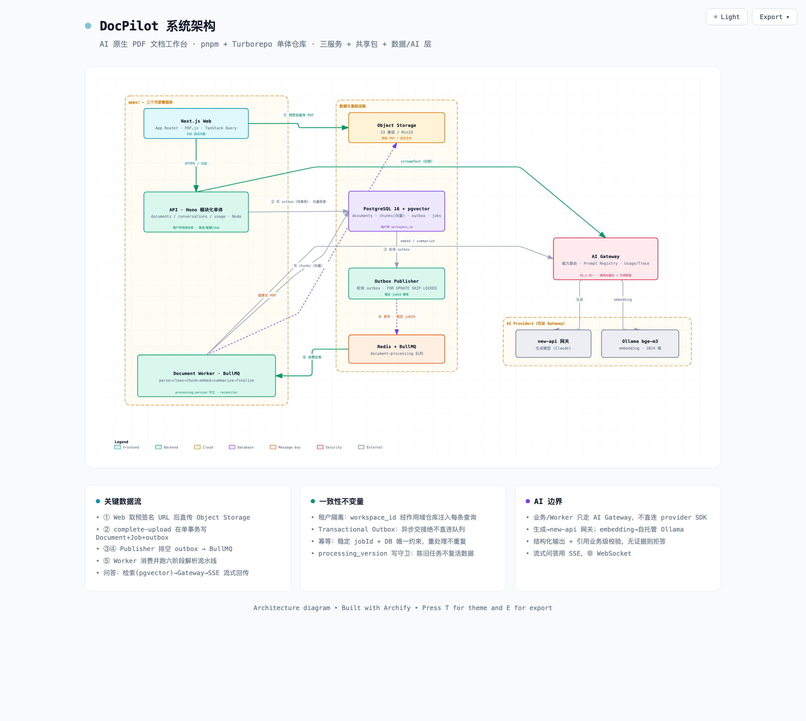

# DocPilot — AI 文档工作台

DocPilot 是一个 **AI Native 的个人文档工作台**。它把一个确定性的业务系统、异步数据处理管线、非确定性的 AI 能力、权限与安全、成本与可观测性，以及 Evaluation 组合成一个完整的产品工程闭环。

核心闭环：

```
登录 → 上传 PDF → 异步解析 → 文本切片 → 生成向量 → 生成摘要
      → 基于文档问答 → 返回带页码引用的答案 → 记录质量/成本/调用链
```

第一版目标不是构建企业级知识库，而是完成一个 **可运行、可测试、可部署、可扩展、可验证 AI 输出** 的个人 AI 文档工作台。

> 本仓库已落地 Phase 1–7：一个可运行的 monorepo（`apps/` 下 Web / API / Worker 三个服务，`packages/` 下共享库）。**设计文档仍是行为契约的权威参考**——实现或变更行为前，先读对应的 [`docs/`](docs/)。

## 文档索引

### 产品
- [产品概述、目标与验收标准](docs/product/overview.md) — 方案目标、非功能指标、文件限制、第一版明确不做、最终验收标准

### 架构

[](docs/architecture/system-diagram.html)

> 系统架构总览：分层组件、三条关键数据流（上传 / 解析流水线 / RAG 问答）与架构不变量。点击查看[交互式版本](docs/architecture/system-diagram.html)（自包含 HTML，下载后浏览器打开：明暗主题切换 + 导出 PNG/SVG）；图形源见 [system-diagram.architecture.json](docs/architecture/system-diagram.architecture.json)。

- [系统数据流图](docs/architecture/system-dataflow.svg) — 文档处理管线与 RAG 问答的端到端数据流转（交互版见 [system-dataflow.html](docs/architecture/system-dataflow.html),含明暗主题切换与 PNG/SVG 导出)
- [架构总览](docs/architecture/overview.md) — 技术栈、总体架构、仓库结构、模块边界、核心领域模型
- [数据模型与存储](docs/architecture/data-model.md) — 数据库 Schema、枚举、对象存储设计
- [处理管线](docs/architecture/pipeline.md) — 上传 API、Transactional Outbox、异步任务、状态机、PDF 解析、Chunk、Embedding、删除流程
- [RAG 与 AI](docs/architecture/rag.md) — 向量检索、上下文构建、Prompt 管理、AI Gateway、摘要、问答流式接口、幂等性
- [横切关注点](docs/architecture/cross-cutting.md) — 权限、安全、限流与配额、成本统计、可观测性、本地开发、CI、部署
- [测试与 Evaluation](docs/architecture/testing-and-eval.md) — 测试策略、Evaluation 体系

### 决策记录
- [ADR 索引](docs/adr/README.md) — 10 条关键架构决策
- [决策日志](DECISIONS.md) — 超轻量 ADR：日常开发/重构中「选了什么、否了什么及原因、何时重审」的留痕

### 运维手册
- [生产部署](docs/runbooks/deployment.md) — 镜像构建、compose 编排、托管服务切换、关键环境变量
- [故障恢复](docs/runbooks/failure-recovery.md) — Reconciliation Job、超时任务、租约机制
- [万级 DAU 资源规划](docs/runbooks/capacity-planning.md) — 负载模型、逐组件资源、连接预算、配置旋钮、成本与上线清单

### 实施计划
- [分阶段路线图](.ai/plans/roadmap.md) — Phase 1–7 的产出与验收标准
